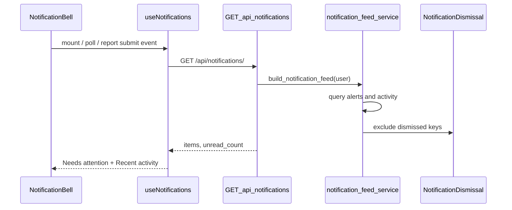

# In-App Notifications (Navbar Bell)

The navbar bell provides a unified **in-app notification feed** for authenticated staff users. It combines **actionable alerts** (things that need attention) with a **recent activity** section (confirmations of actions the current user performed).

Email, SMS, push notifications, and system-wide events (for example “new member registered”) are **not** part of this feature. See [FUTURE_IMPROVEMENTS.md](./FUTURE_IMPROVEMENTS.md) for planned channel and preference work.

## Overview

| Aspect | Design |
|--------|--------|
| Data source | **Computed on read** from existing domain tables (weekly reports, follow-up tasks, admin auth models) |
| Persistence | `NotificationDismissal` only — tracks which items a user has dismissed |
| Updates | Frontend polls every **60 seconds** while the browser tab is visible; immediate refresh after weekly report submit |
| Visibility | All roles except **VISITOR**; bell is hidden for visitors |

### Feed categories

| `category` | Red badge | Purpose |
|------------|-----------|---------|
| `alert` | Counts toward `unread_count` | Requires action or oversight (submit report, approve reset, overdue follow-up) |
| `activity` | Does **not** affect badge | Confirms the user’s own recent actions (e.g. report submitted successfully) |

Dismissed items are hidden until the underlying condition changes (new week, new pending reset, etc.). Activity items also drop out automatically after **7 days**, even if not dismissed.

## Architecture



### Backend (`apps.notifications`)

| File | Role |
|------|------|
| [`backend/apps/notifications/models.py`](../backend/apps/notifications/models.py) | `NotificationDismissal` model |
| [`backend/apps/notifications/services.py`](../backend/apps/notifications/services.py) | Feed builders and orchestration |
| [`backend/apps/notifications/scoping.py`](../backend/apps/notifications/scoping.py) | Evangelism group coordinator scoping |
| [`backend/apps/notifications/views.py`](../backend/apps/notifications/views.py) | REST endpoints |
| [`backend/apps/notifications/urls.py`](../backend/apps/notifications/urls.py) | URL routing |

Cluster coordinator scoping reuses [`managed_cluster_ids_for_coordinator`](../backend/apps/clusters/permissions.py) from the clusters app.

### Frontend

| File | Role |
|------|------|
| [`frontend/src/components/layout/NotificationBell.tsx`](../frontend/src/components/layout/NotificationBell.tsx) | Bell UI and dropdown |
| [`frontend/src/hooks/useNotifications.ts`](../frontend/src/hooks/useNotifications.ts) | Fetch, poll, dismiss |
| [`frontend/src/types/notifications.ts`](../frontend/src/types/notifications.ts) | TypeScript types |
| [`frontend/src/lib/notificationsEvents.ts`](../frontend/src/lib/notificationsEvents.ts) | `requestNotificationsRefetch()` after report submit |
| [`frontend/src/lib/api.ts`](../frontend/src/lib/api.ts) | `notificationsApi` client |

The bell is rendered from [`Navbar.tsx`](../frontend/src/components/layout/Navbar.tsx) inside `DashboardLayout`.

## API

Base path: `/api/notifications/`

**Authentication:** JWT required. Permission: `IsAuthenticatedAndNotVisitor` (same as most modules).

### `GET /api/notifications/`

Returns the current user’s visible feed (non-dismissed items).

**Response:**

```json
{
  "unread_count": 2,
  "alert_count": 2,
  "activity_count": 1,
  "items": [
    {
      "key": "cluster_report_due:12:2025:21",
      "category": "alert",
      "type": "cluster_report_due",
      "severity": "info",
      "title": "Submit cluster report — Week 21",
      "body": "Cluster Alpha has no report for this week yet",
      "href": "/clusters?tab=reports&cluster=12&week=21",
      "occurred_at": "2025-05-29T10:00:00+00:00"
    }
  ]
}
```

- `unread_count` — count of non-dismissed items where `category === "alert"` only.
- Items are sorted by `occurred_at` descending, capped at **50** total.

### `POST /api/notifications/{notification_key}/dismiss/`

Marks one item as read for the current user. `notification_key` must be URL-encoded (slashes and colons are allowed in keys).

Returns the same shape as `GET` (updated feed).

### `POST /api/notifications/dismiss-all/`

Dismisses every item currently visible in the feed for the current user.

Returns the same shape as `GET` (typically empty `items`).

## Notification types

### Alerts (`category: "alert"`)

| `type` | Who sees it | Trigger |
|--------|-------------|---------|
| `password_reset_pending` | `ADMIN` | `PasswordResetRequest` with `status=PENDING` |
| `account_locked` | `ADMIN` | `AccountLockout` indicating an active lock |
| `cluster_report_due` | Users who **manage** at least one cluster; CLUSTER module enabled | No `ClusterWeeklyReport` for managed cluster for **current ISO week** |
| `evangelism_report_due` | Users who **manage** at least one evangelism group; EVANGELISM module enabled | No `EvangelismWeeklyReport` for managed group for current ISO week |
| `cluster_report_overdue` | `ADMIN`, `PASTOR`, or cluster **senior coordinator** | Clusters in oversight scope missing this week’s report (excludes clusters the user already gets as `cluster_report_due`) |
| `follow_up_overdue` | User assigned on `FollowUpTask` | `due_date` before today; status `PENDING` or `IN_PROGRESS` |
| `follow_up_due_soon` | Same | Due within the next **3 days**; same statuses |

**Coordinator applicability:** Cluster and evangelism due reminders are **independent**. A user who coordinates both a cluster and an evangelism group can receive **both** due alerts when neither report is filed.

**Severity for report due:** `info` Monday–Wednesday; `warning` Thursday–Sunday (server local date).

**Stable keys (examples):**

- `cluster_report_due:{cluster_id}:{year}:{week_number}`
- `evangelism_report_due:{group_id}:{year}:{week_number}`
- `activity:cluster_report_submitted:{report_id}`

### Activity (`category: "activity"`)

| `type` | Source | Window |
|--------|--------|--------|
| `cluster_report_submitted` | `ClusterWeeklyReport` where `submitted_by` = current user | `submitted_at` within last 7 days |
| `evangelism_report_submitted` | `EvangelismWeeklyReport` where `submitted_by` = current user | Same |

These items use `severity: "success"` and do not increment the bell badge.

## Coordinator scoping

### Clusters

Uses [`managed_cluster_ids_for_coordinator`](../backend/apps/clusters/permissions.py):

- `Cluster.coordinator` FK
- `ModuleCoordinator` rows: module `CLUSTER`, level `COORDINATOR`, non-null `resource_id`

### Evangelism groups

Uses [`managed_evangelism_group_ids_for_coordinator`](../backend/apps/notifications/scoping.py):

- `EvangelismGroup.coordinator` FK (active groups only)
- `ModuleCoordinator` rows: module `EVANGELISM`, level `COORDINATOR`, non-null `resource_id`

Broad senior-coordinator assignments (`resource_id` NULL) do **not** expand due reminders to every group; only FK and explicitly scoped group IDs apply.

### Oversight (`cluster_report_overdue`)

- **ADMIN:** all clusters
- **PASTOR:** branch-filtered unless headquarters (see branch rules in [ACCESS_CONTROL.md](./ACCESS_CONTROL.md))
- **Cluster senior coordinator:** all clusters (subject to module enabled)

## Deep links

Clicking a notification navigates via `href`. Pages read query parameters and open the relevant UI, then clear params from the URL.

| Route | Query params | Behavior |
|-------|----------------|----------|
| `/clusters` | `tab=reports`, `cluster={id}`, `week={n}` | Reports tab; open submit form for cluster |
| `/clusters` | `tab=reports`, `report={id}` | Reports tab; open report in edit form |
| `/evangelism` | `group={id}` | Reports tab; open submit modal with group pre-selected |
| `/evangelism` | `report={id}` | Reports tab; open view modal for report |
| `/admin-settings` | — | Admin security / password reset area |

Implementation:

- [`ClustersPageContainer.tsx`](../frontend/src/app/clusters/ClustersPageContainer.tsx)
- [`evangelism/page.tsx`](../frontend/src/app/evangelism/page.tsx) and [`EvangelismReportsDashboard.tsx`](../frontend/src/components/evangelism/EvangelismReportsDashboard.tsx)

## Frontend behavior

### Polling and refresh

- Initial fetch when the user is authenticated and not a visitor.
- Poll every **60s** when `document.visibilityState === "visible"`.
- Refetch when the dropdown opens.
- After a successful cluster or evangelism weekly report create/update, call `requestNotificationsRefetch()` from [`notificationsEvents.ts`](../frontend/src/lib/notificationsEvents.ts) so activity appears without waiting for the poll.

### UI

- **Needs attention** — alerts; empty copy: “Nothing needs your attention”
- **Recent activity** — activity items; section hidden when empty
- **Mark all read** — calls `dismiss-all`
- Clicking an **alert** dismisses it and navigates; clicking **activity** navigates without auto-dismiss

## Module gating

If a module is disabled in **Module Settings** (`ModuleSetting.is_enabled`), notification builders for that module are skipped:

- CLUSTER off → no cluster due, overdue, or cluster activity items
- EVANGELISM off → no evangelism due or evangelism activity / follow-up items

## Database

**Model:** `NotificationDismissal`

| Field | Description |
|-------|-------------|
| `user` | FK to `Person` (AUTH_USER_MODEL) |
| `notification_key` | Stable string identifier |
| `dismissed_at` | Auto-set on create |

Unique together: `(user, notification_key)`.

**Migration:**

```bash
cd backend
python manage.py migrate apps.notifications
```

## Testing

```bash
cd backend
python manage.py test apps.notifications --settings=core.settings_test
```

Tests cover coordinator due scoping, activity vs unread count, dismiss / dismiss-all, admin alerts, and visitor denial.

## Manual verification checklist

1. Log in as a **cluster coordinator** with no report this week → bell badge shows a count; “Submit cluster report” alerts for each managed cluster.
2. Submit a cluster report → due alert gone for that cluster; success line under **Recent activity**; badge unchanged if no other alerts.
3. Log in as **evangelism coordinator** only → evangelism due items, no cluster due.
4. User with **both** roles, neither report filed → both due types.
5. **ADMIN** with pending password reset → admin alert; link to `/admin-settings`.
6. Dismiss one alert → removed from list; badge decreases.
7. **VISITOR** → no bell in navbar.

## Related documentation

- [ACCESS_CONTROL.md](./ACCESS_CONTROL.md) — roles and coordinator assignments
- [CLUSTERS_MODULE.md](./CLUSTERS_MODULE.md) — weekly cluster reports
- [EVANGELISM_MODULE.md](./EVANGELISM_MODULE.md) — evangelism reports and follow-up tasks
- [AUTHENTICATION_MODULE.md](./AUTHENTICATION_MODULE.md) — password reset requests
- [FUTURE_IMPROVEMENTS.md](./FUTURE_IMPROVEMENTS.md) — email/SMS and preferences (planned)

## Future extensions (not implemented)

- Persisted `Notification` rows with Django signals for org-wide events
- User notification preferences and channels (email/SMS)
- Additional activity types (follow-up completed, enrollment, etc.)
- WebSocket or SSE for real-time delivery (polling is sufficient for v1)
